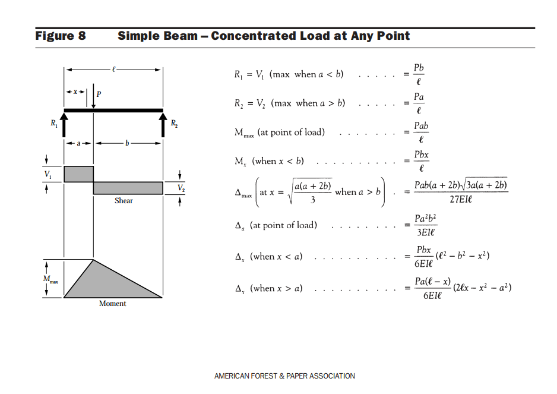

# Beam Shear Force and Bending Moment Calculator

A Python tool for analyzing simply supported beams with concentrated load at any point.

## Overview

This calculator computes:
- Shear force distribution along the beam
- Bending moment distribution
- Visual diagrams of both

Formulas and beam configuration based on standard engineering references (American Forest & Paper Association - Beam Design Formulas, Figure 8).

## Beam Configuration



*Figure 8: Simple Beam - Concentrated Load at Any Point*  
*Source: American Forest & Paper Association*

**Parameters:**
- `ℓ` = Total beam length (m)
- `P` = Point load magnitude (kN)
- `a` = Distance from left support to load (m)
- `b` = Distance from load to right support (m), where b = ℓ - a

**Reactions:**
- R₁ = V₁ = Pb/ℓ (max when a < b)
- R₂ = V₂ = Pa/ℓ (max when a > b)

## Installation
```bash
pip install numpy matplotlib
```

## Usage
```python
python beam_analysis.py
```

**Example:**
```
Enter the Length of the Beam: 20
Enter the Load force P: 10
Enter distance 'a' from left support to load: 8
```

## Output

The program generates:
- Console output with calculated reactions and maximum values
- Plots showing:
  - Shear force diagram
  - Bending moment diagram
  - Deflection curve 

## Technical Details

**Formulas implemented:**

**Reactions:**
```
R₁ = Pb/ℓ
R₂ = Pa/ℓ
```

**Shear Force:**
```
V = R₁        (when x < a)
V = R₁ - P    (when x > a)
```

**Bending Moment:**
```
M = R₁·x           (when x < a)
M = R₁·x - P(x-a)  (when x > a)
```

**Maximum Moment:**
```
M_max = Pab/ℓ  (at point of load)
```

## Files Structure
```
beam-analysis-tool/
├── beam_analysis.py           # Main calculation script
├── reference_diagram_AFPA_Fig8.png  # Reference diagram from source
├── results/                   # Output plots (generated)
│   └── example_output.png
└── README.md                  # This file
```

## Learning Outcomes

Through this project, I practiced:
- Implementing engineering formulas in Python
- Structural mechanics calculations (shear, moment, deflection)
- Data visualization with matplotlib
- Conditional logic for different beam sections
- NumPy array operations

## Example Results

*


## Reference

This analysis is based on:

**Source:** American Forest & Paper Association  
**Publication:** Beam Design Formulas  
**Figure:** Figure 8 - Simple Beam, Concentrated Load at any point  
**Usage:** Educational reference for formula implementation

**Copyright Notice:** The reference diagram is included under fair use for educational purposes. All rights to the original material remain with the American Forest & Paper Association. This is a non-commercial student learning project.
```
```
Source: American Forest & Paper Association - Beam Design Formulas, Figure 8

## Author

Yvonne Rutendo Manyanda  
Second-year Civil Engineering Student   
23 February 2026

---
